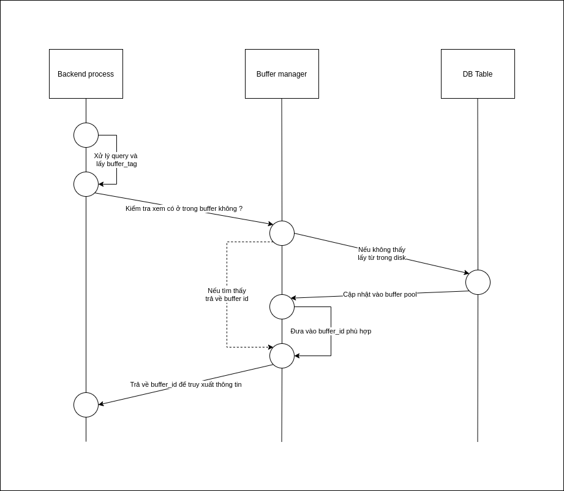

# ***POSTGRESQL BUFFER***
> [Bài viết gốc](https://online.grokking.org/articles/13/postgresql-buffer-hoat-dong-nhu-the-nao-)

## **Mục lục**:
- [***POSTGRESQL BUFFER***](#postgresql-buffer)
  - [**Mục lục**:](#mục-lục)
  - [**Buffer là gì ?**](#buffer-là-gì-)
  - [**Buffer Manager**:](#buffer-manager)
  - [**Buffer pool đầy**:](#buffer-pool-đầy)
  - [**Cập nhật dữ liệu**:](#cập-nhật-dữ-liệu)

## **Buffer là gì ?**
- Nguyên tắc hoạt động: Đưa 1 phần dữ liệu thường dùng vào RAM để tăng tốc độ truy xuất.
- **Phân biệt với cache:**
  - Cache lưu các dữ liệu đã đuợc xử lý vào bộ nhớ tạm (Ram hoặc local storage của người sử dụng) -> Tiết kiệm thời gian *tính toán*
  - Lưu dữ liệu thô, phục vụ cho các lần tính toán -> Tiết kiệm thời gian *truy xuất*

## **Buffer Manager**:
- Thành phần chính:
  - Buffer table
  - Buffer descriptor: Quản lý metadata của buffer slot
  - Buffer pool:
    - 1 array
    - Mỗi slot được cấp 1 buffer_id
  
- Buffer tag:
  - Gồm 3 số
  - Dùng để định dang page thuộc table nào trong database
  - Page thứ mấy của table

- Xử  lý query:
  - 

## **Buffer pool đầy**:
- Từ phiên bản 8.1, sử dụng clock sweep, loại bỏ các page thỏa mãn
  - Ít được truy xuất nhất
  - Không có tiến trình nào đang truy xuất page đó

## **Cập nhật dữ liệu**:
- Dữ liệu được cập nhật vào trong buffer (Tạo ra **dirty page**)
- Sau 1 thời gian, dữ liệu được lưu lại xuống disk (Flush dirty pages)
- Để đảm bảo cho dữ liệu, sử dụng WAL - Write Ahead Log để cập nhật lại nếu bị mất dữ liệu ở các **dirty pages**.