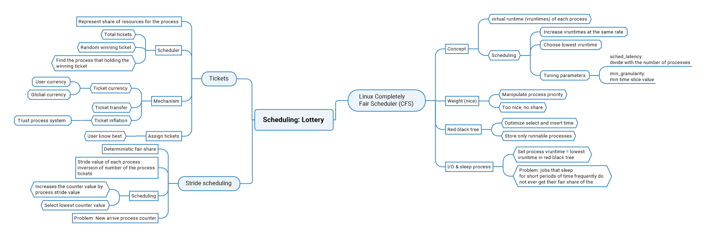
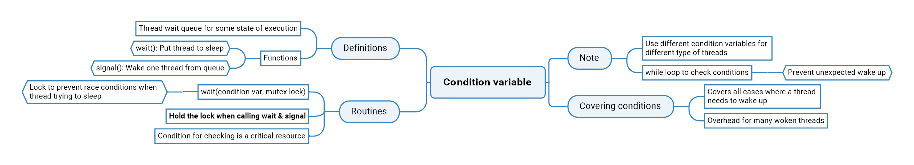
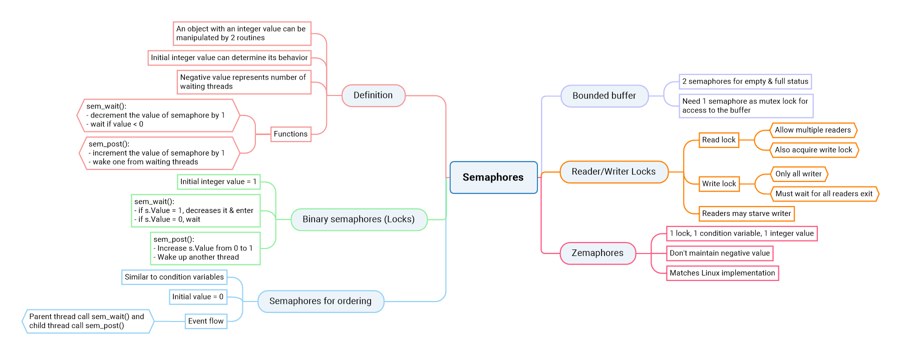
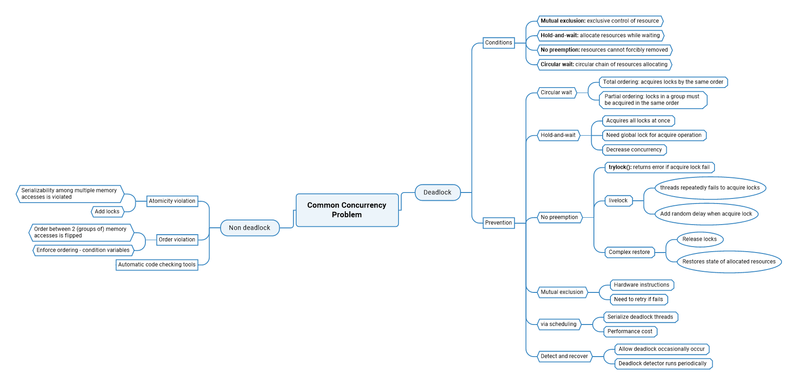
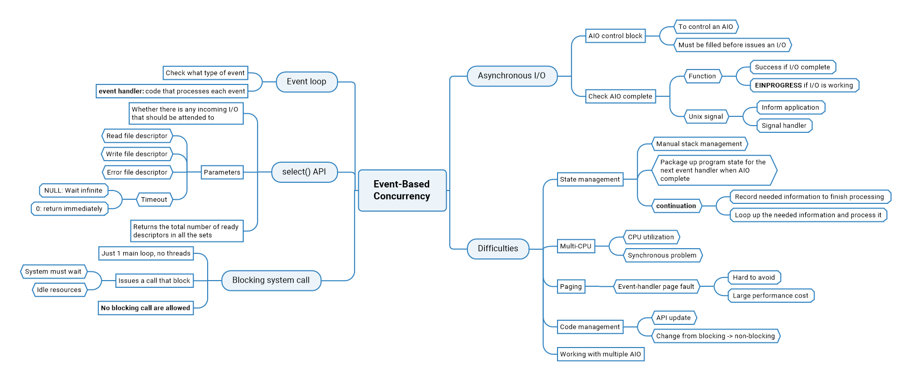
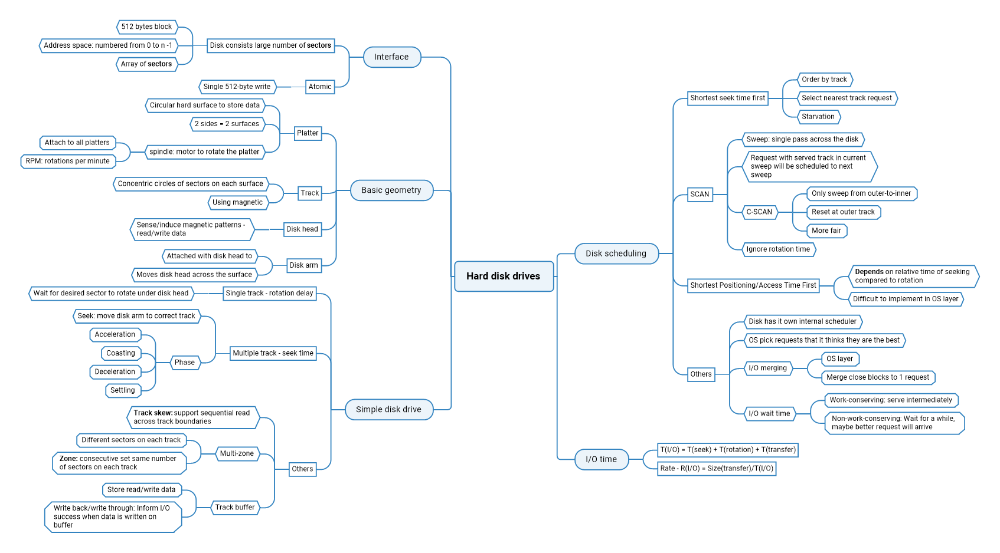

# Operating Systems: Three Easy Pieces

Link sách: [https://pages.cs.wisc.edu/~remzi/OSTEP/\#book-chapters](https://pages.cs.wisc.edu/~remzi/OSTEP/#book-chapters)

## I. Ảo hóa

### 1. Process

### 2. Scheduler

### 3. Memory

## II. Đồng thời

## III. Persistent

