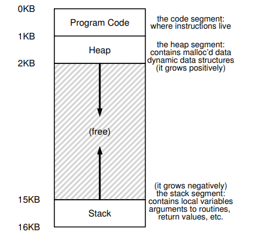

# Không gian địa chỉ

## 1. Hệ thống đa lập trình và chia sẻ thời gian

\_ Trong thời đại đa lập trình, khi nhiều tiến trình sẵn sàng được chạy tại một thời điểm, HĐH sẽ switch giữa các tiến trình để tăng tính hiệu quả của việc sử dụng CPU. 

\_ Trong thời đại chia sẻ thời gian, việc yêu cầu các tiến trình chạy đồng thời là điều thiết yếu.

* Một cách để giải quyết là chạy tiến trình 1 thời gian rồi chuyển lại cho tiến trình khác. Lưu lại các trạng thái của tiến trình cũ xuống đĩa và cập nhật trạng thái của tiến trình mới.
* Tuy nhiên, cách làm trên có tốc độ càng chậm khi bộ nhớ của tiến trình càng lớn. Cho nên, các tiến trình thường được **lưu trong bộ nhớ chính** và HĐH chuyển đổi giữa chúng.
* Việc này cần đảm bảo sự **bảo vệ** giữa các vùng bộ nhớ của tiến trình.

## 2. Không gian địa chỉ

\_ HĐH trừu tượng hóa bộ nhớ chính \(vật lý\) thành không gian địa chỉ để cho các chương trình có thể sử dụng được bộ nhớ hiệu quả.

\_ Khi chương trình chạy, bộ nhớ của chương trình được chia thành các vùng nhớ:

* Vùng chứa code: Nơi lưu các chỉ dẫn
* **Stack**: theo dõi vị trí trong các chuỗi lời gọi hàm, cấp phát cho biến cục bộ và truyền tham số, trả về giá trị đi và tới từ các routine.
* **Heap**: dùng cho việc cấp phát động, bộ nhớ do người dùng quản lý \(_malloc_ trong C hoặc _new_\)

\_ Các vùng nhớ Heap hoặc Stack thường được hiểu sẽ tăng dần theo hướng **ngược nhau**, tuy nhiên đây chỉ là một cách quy ước. Còn chúng ta có thể tự sắp xếp theo cách cách khác, nhất là đối với các hệ thống nhiều luồng cùng xuất hiện trong một không gian địa chỉ.

\_ HĐH sẽ cấp phát cho các chương trình từng không gian địa chỉ riêng, và **ánh xạ** không gian địa chỉ đó tới các địa chỉ vật lý trên phần cứng.

## 3. Mục đích

\_ Việc ảo hóa bộ nhớ cần phải đạt được những mục tiêu sau:

* Tính trong suốt: các chương trình không thấy được việc bộ nhớ đã được ảo hóa và tự sử dụng không gian địa chỉ dành riêng cho tiến trình đó. HĐH sẽ duy trì và điều khiển bộ nhớ giữa các tiến trình.
* Tính hiệu quả: đảm bảo về cả mặt thời gian \(tốc độ\) và không gian \(dùng để quản lý\). Thường cần dựa vào sự hỗ trợ của phần cứng.
* Tính bảo vệ: Để các tiến trình **độc lập** với nhau.

