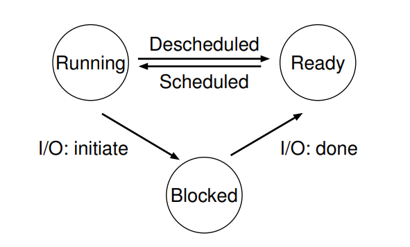

# Tiến trình \(Process\)

**Tiến trình:** là một chương trình đang chạy.

* Chương trình: là một tổ hợp các hướng dẫn và dữ liệu được lưu trên bộ nhớ. 

Để giải quyết việc chạy song song nhiều tiến trình, HĐH đã ảo hóa CPU \(vật lý\):

* Bằng cách chạy một tiến trình rồi dừng lại và chạy tiến trình khác
* Như vậy, có thể cảm giác rằng máy tính có rất nhiều CPU \(ảo\) hay các tiến trình đều chạy song song.
* Một kỹ thuật thường thấy là **chia sẻ theo thời gian** 

Để ảo hóa CPU, HĐH sử dụng 2 tầng cơ chế:

* Tầng thấp: Các hàm và giao thức
* Tầng cao: Các thuật toán để quyết định việc chia sẻ tài nguyên

## 1. Tiến trình

**Trạng thái máy** _\(machine state\)_ của tiến trình:

* Bộ nhớ: Chỉ dẫn nằm trong bộ nhớ, dữ liệu để chạy chương trình
* Thanh ghi: nhiều chỉ dẫn đọc và cập nhật thanh ghi để thực thi chương trình
  * Có các thanh ghi đặc biệt như PC\(Program counter\) - Chỉ dẫn nào cần được thực hiện tiếp theo, con trỏ stack \(stack pointer\), con trỏ frame \(frame pointer\) - dùng để quản lý stack cho tham số của hàm, biến cục bộ, địa chỉ trả về
* Thông tin vào ra \(I/O information\): chứa thông tin các truy nhập của chương trình đến hệ thống file và các thiết bị khác

## 2. API của tiến trình

Một số các API của tiến trình thường thấy trong các HĐH hiện đại:

* Tạo mới
* Hủy bỏ
* Dừng
* Điều khiển khác \(Miscellaneous control\): ví dụ như dừng tiến trình trong một khoảng thời gian
* Trạng thái: lấy thông tin về tiến trình

## 3. Tạo tiến trình

Để có thể tạo một tiến trình mới, đầu tiên, HĐH chuyển phần code và các dữ liệu tĩnh vào bộ nhớ trong. Trong các HĐH hiện đại, phần code được chuyển từng phần một, chỉ dùng đến các phần phục vụ cho việc chạy chương trình.

Tiếp theo, HĐH cần cung cấp bộ nhớ cho vùng nhớ stack \(run-time stack\) của chương trình. Cùng với đó vùng nhớ heap cũng sẽ được cấp phát \(vùng nhớ này ban đầu được cấp phát nhỏ nhưng có thể lớn dần theo nhu cầu của chương trình\).

HĐH cũng cần làm các nhiệm vụ khởi tạo, liên quan tới hoạt động vào/ra. Ví dụ như giao tiếp với file, ....

Cuối cùng, HĐH chạy chương trình tại điểm đầu vào \(entry point\), thường là hàm main\(\), CPU được chuyển cho tiến trình vừa mới tạo và bắt đầu thực thi chương trình.

## 4. Trạng thái của tiến trình

Trong các hệ thống thời đầu tiên, tiến trình được chia ra làm 3 trạng thái:

* Đang chạy: đang sử dụng CPU, thực thi các chỉ dẫn.
* Sẵn sàng: Có thể chạy nhưng HĐH chưa cho phép thực thi.
* Bị chặn: Tiến trình đang thực hiện các hoạt động làm nó chưa sẵn sàng cho tới khi một sự kiện nào đó xảy ra. Thường là các hoạt động vào/ra

## 5. Cấu trúc dữ liệu

HĐH cũng là một chương trình, và cần có các CTDL để lưu giữ các thông tin cần thiết.

Để lưu trữ thông tin về tiến trình, HĐH thường lưu:

* Danh sách các tiến trình: trạng thái của tiến trình, các sự kiện I/O cần phải đợi
* Thanh ghi trạng thái/ngữ cảnh \(register context\): lưu thông tin của một tiến trình khi nó dừng lại để có thể phục hồi lại sau
* Khối quản lý tiến trình \(PCB - Process Control Block\): lưu giữ liệu từng tiến trình

