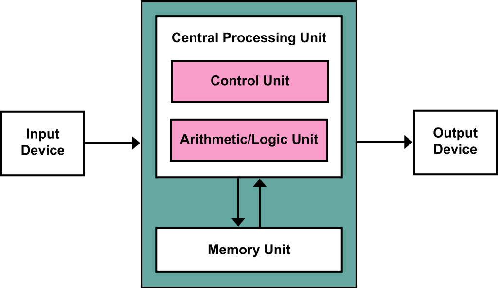

# Giới thiệu

## Mô hình Von Neumann

Bộ xử lý sẽ nhận chỉ thị từ bộ nhớ, giải mã và thực hiện chúng.

## Ảo hóa tài nguyên \(Virtualize Resource\)

Việc này giúp cho hệ thống dễ dàng hơn khi sử dụng.  
HĐH sẽ lấy tài nguyên vật lý và chuyển đổi chúng thành các **tài nguyên ảo** để phục vụ cho mục đích sử dụng \(Có thể coi HĐH như một máy ảo\).

Việc sử dụng tài nguyên sẽ được thông qua các **lời gọi hệ thống,** ví dụ như chạy chương trình, truy cập đến bộ nhớ, các thiết bị, .... HĐH cung cấp một **thư viện chuẩn** cho ứng dụng.

Do HĐH cung cấp tài nguyên cho nhiều chương trình, các tài nguyên này sẽ luôn được yêu cầu sử dụng bởi nhiều chương trình cùng một lúc. Nên HĐH cần phải **quản lý tài nguyên.**

## Ảo hóa CPU

 HĐH ảo hóa CPU khiến trên góc nhìn người dùng, một máy tính giống như có nhiều CPU để chạy nhiều chương trình khác nhau. \(nhiều chương trình có thể chạy song song\)

## Ảo hóa bộ nhớ

Trong hệ điều hành, bộ nhớ được biểu diễn thành **một dãy các bytes.** 

* Khi đọc, cần phải chỉ đến đúng địa chỉ của ô nhớ
* Tương tự đối với khi ghi dữ liệu

Mỗi tiến trình có một **vùng nhớ ảo** của chính nó, HĐH sẽ liên kết vùng nhớ đó với bộ nhớ vật lý, tách biệt với vùng nhớ của các tiến trình khác trong hệ thống.

## Song song/tương tranh \(Concurrency\)

HĐH cần quản lý nhiều tiến trình chạy cùng một thời điểm.   
Hơn nữa, trong các chương trình đa luồng hiện nay cũng xuất hiện việc quản lý các luồng song song. 

## Persistence \(toàn vẹn\)

Trong hệ thống, các dữ liệu lưu trong bộ nhớ có thể bị mất một cách dễ dàng. Nên chúng ta cần cả phần cứng và phần mềm có thể bảo đảm được tính toàn vẹn của dữ liệu.

Đối với phần cứng, điều này được giải quyết bằng các thiết bị vào ra \(HDD, SSD\) để lưu trữ dữ liệu trong thời gian dài.

HĐH sử dụng một hệ thống file để quản lý các ổ đĩa. Không như CPU và bộ nhớ, HĐH không tạo riêng các vùng riêng cho các tiến trình ở hệ thống file. Mà các file có thể được chia sẻ giữa nhiều tiến trình với nhau.

Để đơn giản hóa việc thao tác với bộ nhớ ngoài, HĐH cũng cung cấp một thư viện chuẩn gồm các lời gọi hệ thống phục vụ cho nhu cầu người dùng.

## Mục tiêu thiết kế

Các chức năng của hệ điều hành:

* Ảo hóa tài nguyên
* Xử lý các công việc tương tranh
* Lưu trữ, bảo đảm toàn vẹn các file 

Yêu cầu của hệ điều hành

* Hiệu suất cao
* Giảm thiểu tối đa chi phí \(overheads\)
  * Thời gian tính toán
  * Bộ nhớ sử dụng
* Bảo vệ giữa các chương trình
  * Cô lập giữa các tiến trình
  * Tránh các chương trình ảnh hưởng tới nhau
* Độ tin cậy cao
* Tiết kiệm năng lượng
* Bảo mật
* Tính di động \(dành cho các thiết bị nhỏ\) 

