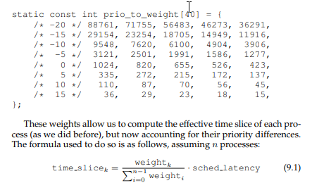
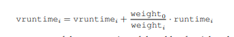

# Lập lịch: Bộ lập lịch xổ số

## 1. Các vé đại diện cho phần được chia sẻ

\_ Các vé được sử dụng để biểu diễn cho phần tài nguyên được chia sẻ mà một tiến trình nên nhận được.

\_ Thực hiện lập lịch:

* Bộ lập lịch cần biết có bao nhiêu vé đang tồn tại trong hệ thống
* Chọn ngẫu nhiên một vé trúng thưởng
* Bộ lập lịch tìm tiến trình giữ vé trúng thưởng và khởi chạy

\_ Việc lựa chọn ngẫu nhiên có thể đáp ứng được tỷ lệ xác suất mong muốn nhưng không đảm bảo. Bên cạnh đó, việc lựa chọn ngẫu nhiên cũng có các hiệu quả sau:

* Tránh được các trường hợp kỳ lạ ít gặp đối với các thuật toán thông thường
* Việc sinh ngẫu nhiên thường nhẹ hơn, và cần ít trạng thái để theo dõi hơn
* Tốc độ của sinh ngẫu nhiên khá nhanh

## 2. Cơ chế vé

\_ Cơ chế **giá trị của vé:**

* Cho phép người dùng tự cài đặt giá trị của các vé như ý muốn
* Hệ thống tự động chuyển đổi giá trị vé của người dùng thành giá trị của hệ thống

\_ Cơ chế **chuyển nhượng vé**:

* Một tiến trình có thể tạm thời chuyển vé của mình cho tiến trình khác
* Thường dùng trong hệ thống client-server, client đưa vé của mình cho server để tăng tốc độ xử lý

\_ Cơ chế **lạm phát vé:**

* Một tiến trình có thể tăng hoặc giảm số lượng vé của chính nó
* Áp dụng cho hệ thống các tiến trình đáng tin cậy
* Tiến trình có thể tăng giá trị của vé thể hiện nhu cầu sử dụng tài nguyên cao

## 3. Cấp phát vé

\_ Khó khăn trong việc quyết định cấp phát bao nhiêu vé cho một tiến trình

\_ Giả định rằng người dùng biết được nhu cầu của mình, và tự cấp phát vé cho tiến trình để sắp xếp chạy.

## 4. Stride Scheduling \(Lập lịch bước đi\)

\_ Bộ lập lịch chia sẻ công bằng có xác định \(deterministic fair-share scheduler\).

\_ Mỗi tiến trình sẽ có 1 giá trị bước đi, tỷ lệ nghịch với số lượng vé mà tiến trình đó nắm giữ. Mỗi khi tiến trình được chạy, biến đếm của tiến trình sẽ được tăng một giá trị bằng với giá trị bước đi của tiến trình đó.

\_ Bộ lập lịch sẽ dựa vào giá trị biến đếm để chạy tiến trình, tại thời điểm cần lựa chọn, bộ lập lịch sẽ chọn ra tiến trình có giá trị biến đếm thấp nhất.

\_ Vấn đề của bộ lập lịch này là khi tiến trình mới đến, nếu để giá trị biến đếm của nó bằng 0 thì nó sẽ độc chiếm CPU cho đến khi biến đếm của nó lớn hơn biến đếm của các tiến trình đang chạy trong hệ thống.

## 5. Linux Completely Fair Scheduler \(CFS\)

### 5.1. Ý tưởng cơ bản

\_ CFS chia sẻ đồng đều CPU cho tất cả các tiến trình, thông qua kỹ thuật đếm cơ bản thời gian chạy ảo \(**virtual runtime - vruntime**\)

* Mỗi khi tiến trình chạy, nó tích lũy vruntime. Các vruntime của các tiến trình được tăng ở mức tương tự nhau. Và khi cần quyết định lập lịch, bộ lập lịch sẽ chọn tiến trình có giá trị vruntime thấp nhất.
* CFS có các tham số để điều chỉnh quá trình lập lịch:
  * **sched\_latency**: thời gian mà một tiến trình nên được chạy trước khi thực hiện đổi chỗ với tiến trình khác. CFS sẽ lấy giá trị này chia cho số lượng các tiến trình để xác định khung thời gian cho từng tiến trình. Đảm bảo sự công bằng cho các tiến trình.
  * **min\_granularity:** Thời gian nhỏ nhất của một khung thời gian được đặt cho tiến trình, đảm bảo giới hạn cho chi phí lập lịch.

### 5.2. Trọng lượng \(Niceness\)

\_ CFS cũng cung cấp sự điều khiển cho mức độ quan trọng của các tiến trình, cho phép người sử dụng cấp cho tiến trình mức độ chia sẻ cao hơn về tài nguyên. Thông qua mức độ **nice** của một tiến trình \(thường là tham số trong khoảng -20 tới +19\). Giá trị càng lớn cho thấy độ ưu tiên của tiếng trình các thấp.

_when you’re too nice,
 you just don’t get as much \(scheduling\) attention_

\_ CFS sẽ ánh xạ các giá trị nice sang một giá trị trọng lượng, cho phép chúng ta tính ra được khung thời gian sẽ cấp cho mỗi tiến trình.

\_ Để tính được vruntime của tiến trình, CFS áp dụng công thức sau:

### 5.3. Sử dụng cây đỏ đen

\_ Tăng tốc thời gian tìm kiếm tiến trình tiếp theo được chạy.

\_ Cây tự cân bằng, giúp duy trì độ sâu thấp và đảm bảo các phép toán thực hiện trong thời gian logarit.

\_ CFS sẽ chỉ giữ các tiến trình sẵn sàng trong cấu trúc này, nếu một tiến trình bị block, nó sẽ bị loại khỏi cây và theo dõi ở nơi khác.

### 5.4. I/O và các tiến trình ngủ đông

\_ Các tiến trình ngủ đông trong thời gian dài sẽ có vruntime thấp, dẫn tới việc động chiến CPU.

\_ CFS sẽ thay đổi vruntime của tiến trình khi nó thức dậy, bằng với vruntime nhỏ nhất ở trong cây đỏ đen.

\_ Tuy nhiên, vẫn còn tồn tại vấn đề là những job thường ngủ trong thời gian ngắn sẽ không có được sự phân bổ tài nguyên công bằng.

