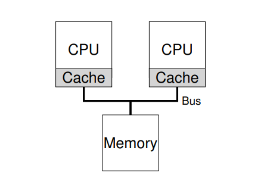

# Lập lịch: Đa vi xử lý \(Multi-CPU\)

## 1. Kiến trúc đa vi xử lý

\_ Điểm khác biệt so với kiến trúc đơn nhân: **caches.** Đây cũng là cách chia sẻ dữ liệu giữa các vi xử lý.

\_ Caches dựa trên khái niệm về **locality \(tính tại chỗ\).** Được chia ra làm 2 loại theo thời gian và không gian:

* Thời gian: Khi 1 đoạn dữ liệu được truy cập, nó sẽ có khả năng cao được truy cập trong thời gian gần.
* Không gian: Khi 1 đoạn dữ liệu ở địa chỉ _x_ được truy cập, thì các địa chỉ gần nó có khả năng cao sẽ được truy cập trong thời gian gần.

\_ Vấn đề xảy ra khi cùng một dữ liệu được lưu và thao tác trên cache của từng CPU sẽ dẫn đến sai lệch thông tin. Được gọi là sự gắn kết trong cache \(**cache coherence**\).

\_ Cách giải quyết cơ bản: theo dõi truy cập đến bộ nhớ chính, đảm bảo việc thực thi đúng và đồng bộ dữ liệu được chia sẻ giữa các tiến trình. Trên các hệ thống sử dụng bus, kỹ thuật rình bus \(**bus snooping**\):

* Các bộ cache sẽ theo dõi bus để xem các cập nhật trên bộ nhớ chính
* Khi thấy dữ liệu mình đang có bị sửa đổi, các bộ cache sẽ loại bỏ dữ liệu đó hoặc tự cập nhật chúng.

## 2. Đồng bộ

\_ Khi truy cập tới một dữ liệu chia sẻ các cơ chế loại trừ sẽ được áp dụng để đảm bảo tính đúng đắn như sử dụng khóa hoặc các cấu trúc dữ liệu không cần khóa \(lock-free\).

\_ Các cơ chế khóa thường được sử dụng, tuy nhiên cách tiếp cận này sẽ làm ảnh hưởng tới hiệu năng. Khi mà càng nhiều CPU cần truy cập đến một dữ liệu chia sẻ đồng bộ, thời gian phải chờ đợi là càng nhiều

## 3. Tương đồng cache \(Cache Affinity\)

\_ Khi 1 tiến trình chạy trên 1 CPU nhất định, nó sẽ ghi lại các trạng thái trong cache. Trong lần tiếp theo mà tiến trình chạy:

* Trên cùng CPU: nhanh hơn vì các trạng thái đã được ghi sẵn
* Trên CPU khác: phải dựng lại các trạng thái, dẫn tới hiệu suất thấp.

 

