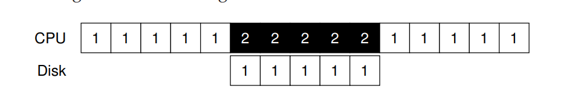

# Thiết bị I/O

## 1. Thiết kế hệ thống

\_ Trên ảnh, 1 CPU được kết nối:

* Bộ nhớ chính thông qua Memory bus
* Các thiết bị hiệu năng cao qua General I/O Bus \(PCIe\)
* Các thiết bị hiệu năng thấp thông qua **Peripheral \(ngoại vi\)** I/O Bus

\_ Cấu trúc phân cấp:

* Giới hạn vật lý và giá thành
* Muốn đẩy cao tốc độ thì các đường dẫn bus phải càng ở gần CPU

## 2. Canonical device

\_ Bao gồm 2 thành phần chính

* Interface của phần cứng: thể hiện với phần còn lại của hệ thống
* Internal structure: Các cài đặt để đảm nhận việc thực thi các API của thiết bị

## 3. Canonical protocol

\_ Một thiết bị đơn giản gồm có các interface tương tác với 3 thanh ghi

* Status: trạng thái của thiết bị
* Command: yêu cầu thực thi nhiệm vụ
* Data: truyền và nhận dữ liệu

\_ Protocol có 4 bước chính

* Kiểm tra trạng thái READY của thiết bị bằng cách liên tục kiểm tra thanh ghi status \(polling\)
* Gửi dữ liệu xuống thanh ghi data
  * Nếu có sự tham gia của CPU - programmed I/O
* Ghi yêu cầu tới thanh ghi command
* Kiểm tra trạng thái của yêu cầu qua thanh ghi Status

\_ Nhược điểm: 

* Polling gây lãng phí tài nguyên CPU khi phải đợi mà không thể thực hiện các tác vụ khác

## 4. Giảm chi phí bằng cách sử dụng interrupt

\_ Khi phần cứng thực hiện xong tác vụ, nó có thể tạo ra 1 interrupt để thông báo. HĐH sẽ sử dụng interrupt handler để hoàn thành tác vụ và điều hướng tới luồng đang chờ I/O đó.

\_ Nhược điểm của interrupt:

* Overhead
  * OS cần phải thực hiện context switch, xử lý interrupt, tiếp tục tiến trình đang chờ
  * Với các tác vụ thực thi nhanh, việc xử lý này có thể gây ảnh hưởng lớn tới hiệu năng hệ thống
  * =&gt; Có thể sử dụng polling cho các tác vụ nhanh
  * **hybrid:** polling 1 thời gian ngắn ban đầu và chuyển về interrupt
* Livelock
  * Hệ thống chỉ xử lý interrupt mà không thể chạy các chương trình của người dùng
  * Tăng thời gian phản hồi
  * Nên sử dụng polling với các hệ thống thực hiện nhiều I/O \(network\)
* Coalescing
  * Gộp nhiều interrupt vào 1 lần xử lý
  * Giảm thiểu ảnh hưởng tới hiệu năng
  * Latency &gt;&lt; Performance

## 5. Direct memory access - DMA

\_ CPU cần tốn thời gian copy data từ trong bộ nhớ vào các thanh ghi của thiết bị.

\_ Việc sử dụng DMA \(thiết bị đặc thù\) có thể điều khiển việc chuyển dữ liệu giữa các thiết bị và bộ nhớ chính.

## 6. Tương tác với các thiết bị

\_ Ở các thế hệ cũ, hệ thống cần phải có các chỉ dẫn I/O rõ ràng \(**explicit I/O instructions**\) chỉ rõ cách HĐH làm việc với **1 thiết bị cụ thể**.

\_ Cách thứ hai là **memory-mapped I/O**, các thanh ghi sẽ được coi như địa chỉ của bộ nhớ mà HĐH có thể truy cập để đọc hoặc ghi dữ liệu.

## 7. Device driver

\_ HĐH có chứa các đoạn phần mềm nhỏ gọi là **device driver** để có thể biết được cách hoạt động của thiết bị và tương tác với chúng.

\_ Nhược điểm: Các thiết bị với tính năng đặc biệt cần phải phù hợp với cả generic interface của kernal có thể dẫn tới các tính năng đó không được sử dụng.

